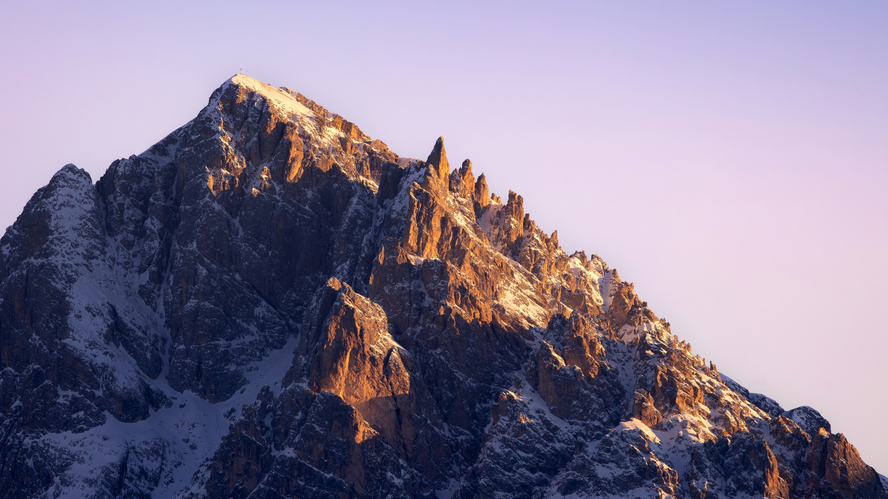
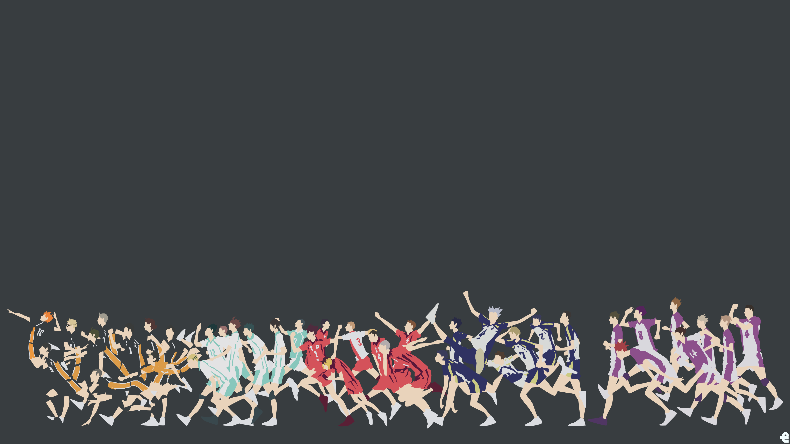
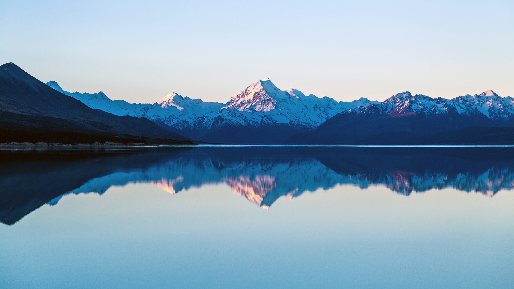
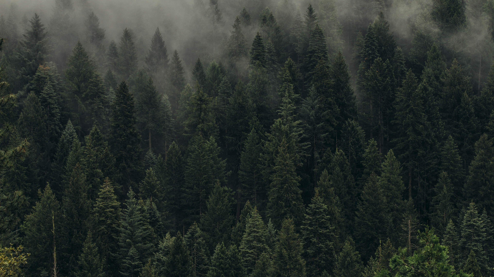
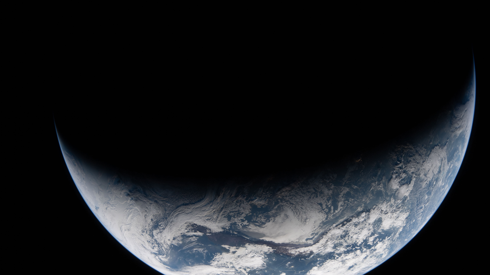
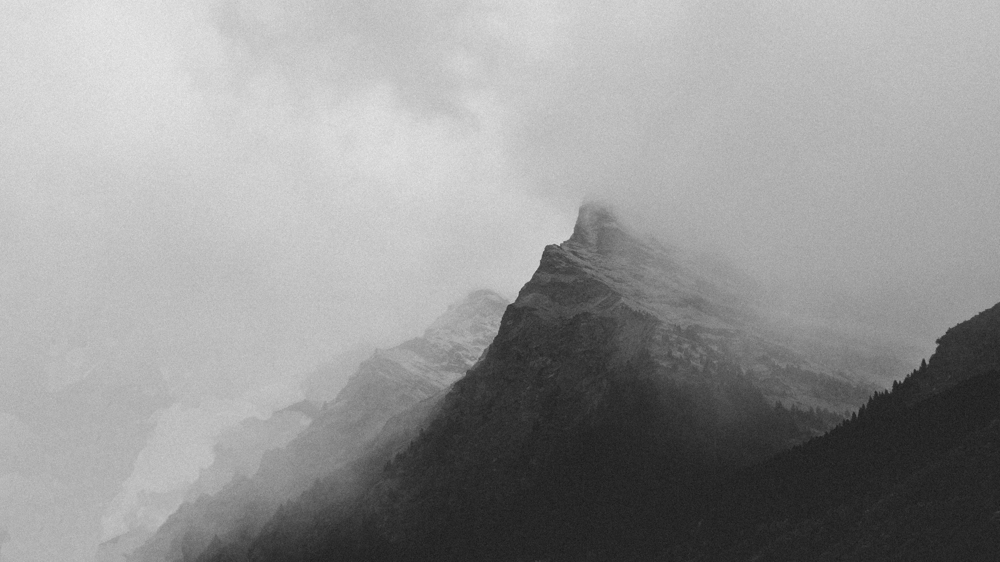
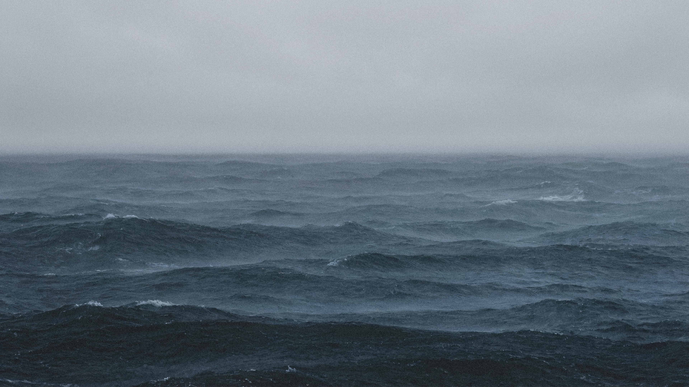

# Usage

1. Add as an input to flake.nix

```nix
{
  inputs = {
    nixpkgs.url = "github:NixOS/nixpkgs/nixos-unstable";
    wallpapers = {
      url = "github:arieimer/wallpapers";
      flake = false;
    };
  };
}
```

2. Use it as needed

```nix
{ inputs, ... }: {
  # ${inputs.wallpapers}/wallpapers on nixos-rebuild will expand into the nix store directory containing all the wallpapers
  # usage can look like this
  programs.noctalia.settings.wallpaper.directory = "${inputs.wallpapers}/wallpapers";
}
```

# Showcase
### wallpapers/wallhaven-1qdz21_3840x2160


### wallpapers/wallhaven-1qrdqw_3840x2160


### wallpapers/wallhaven-2ydj6m_3840x2160


### wallpapers/wallhaven-6l2rgq_3840x2160


### wallpapers/wallhaven-6l5wpl_3840x2160


### wallpapers/wallhaven-6lqvql_3840x2160


### wallpapers/wallhaven-8ordoj_3840x2160


### wallpapers/wallhaven-8x1d5y_3840x2160


### wallpapers/wallhaven-e89l8k_3840x2160


### wallpapers/wallhaven-gw2mel_3840x2160


### wallpapers/wallhaven-gw7xrq_3840x2160


### wallpapers/wallhaven-j3qq15_3840x2160


### wallpapers/wallhaven-je1qxp_3840x2160


### wallpapers/wallhaven-lqxvyy_3840x2160


### wallpapers/wallhaven-ly3eel_3840x2160


### wallpapers/wallhaven-lywevp_3840x2160


### wallpapers/wallhaven-ml2o21_3840x2160


### wallpapers/wallhaven-mll82m_3840x2160


### wallpapers/wallhaven-oggp1m_3840x2160


### wallpapers/wallhaven-oglrv9_3840x2160


### wallpapers/wallhaven-qrdy1l_3840x2160


### wallpapers/wallhaven-rqjrzq_3840x2160


### wallpapers/wallhaven-w5mqr6_3840x2160


### wallpapers/wallhaven-yqj6xx_3840x2160


